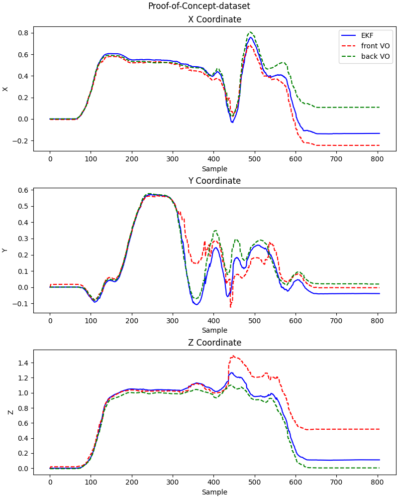
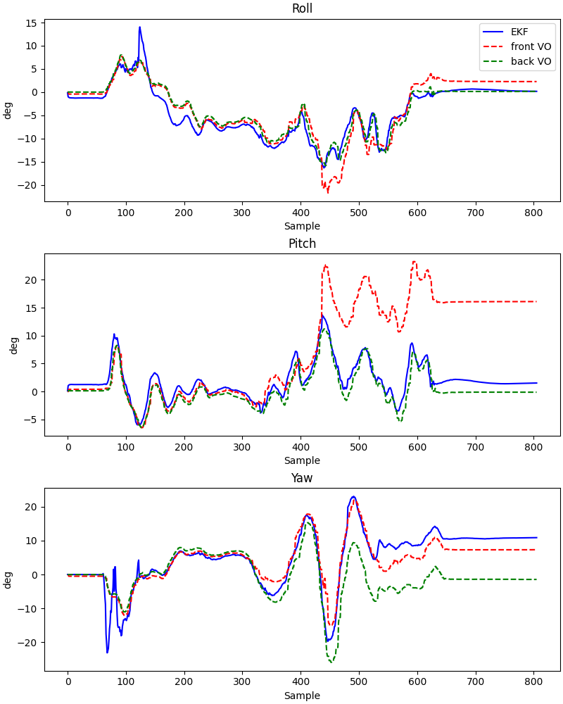
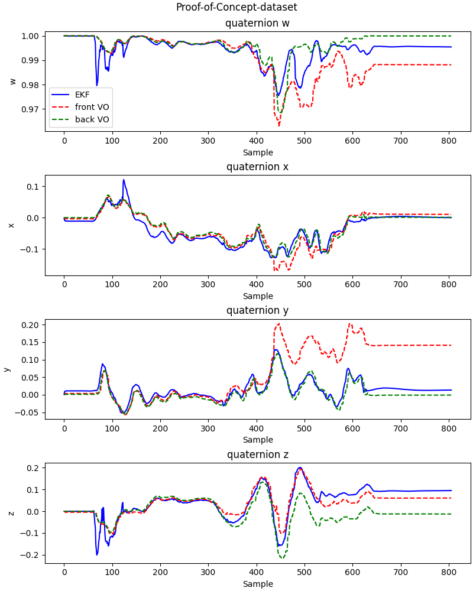

# Multivariate Extended Kalman Filter for UAV localization
 
This repository contains an Extended Kalman Filter (EKF) implementation that combines Visual Odometry data with Inertial Measurement Unit (IMU) measurements. The sensors are loosely coupled, with the main objective of improving the pose estimation for a UAV localization system.

## Features 
- EKF implementation for 19 states
- Quaternion representation of rotations
- Process model with velocity and angular velocity
- Measurement step with two unrelated Visual Odometry pose estimates (easily expandable to more)
- Multirate data processing
- Rosbag reader with callback registration
- Plotter for data visualization
- EKF implemented in symbolic variables

## Results

This dataset serves as a proof of concept and does not depict an actual UAV flight. However, the movements captured within the dataset exhibit characteristic patterns representative of UAV motion in three-dimensional space. You can observe the error in yaw estimation, which arises from gyroscope inaccuracies during periods of intense acceleration, but apart from that the pose estimation is sufficient and successfully fuses all the data.

The dataset lacks groundtruth, therefore the precision cannot be measured.

### Pose(x, y and coordinate)

### Pose(roll, pitch and yaw)

### Pose(orientation in quaternion)

